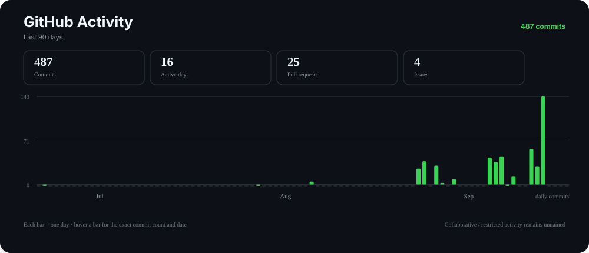

# Oghenesuvwe Omashone

## Cloud & Full-Stack Engineer | ML & AI | Automation | FinOps

I build cloud platforms, ML, AI-enabled systems and automation with a focus on reliability, scalability and cost efficiency.

## GitHub Engineering Activity

**Adaptive 90–365 day view · privacy-aware activity across repositories**

The chart uses the smallest useful window based on activity density: 90 days first, then 120 days, then 365 days when activity is sparse. Only public personal repositories are named. Collaborative and restricted repositories contribute to aggregate activity counts without exposing repository names, organization names, URLs, titles, or other project metadata.

## Selected Engineering Work

### [Terraform AWS ECS Fargate](https://github.com/Oghenesuvwe-dev/Terraform-AWS-ECS-fargate)
Secure containerized web application deployment on AWS using Terraform, with infrastructure defined and provisioned as code.

### [IntelliNemoAgent](https://github.com/Oghenesuvwe-dev/IntelliNemoAgent)
Intelligent infrastructure co-pilot powered by NVIDIA NIM and Nemo Retriever for AI-assisted infrastructure workflows.

### [Synapse Lead Agent](https://github.com/Oghenesuvwe-dev/Synapse-lead-Agent)
Autonomous AI agent for CRM automation that researches, enriches and prioritizes leads in SuiteCRM.

### [ProEngineOps](https://github.com/Oghenesuvwe-dev/ProEngineOps)
GitOps-based multi-cluster Kubernetes management with FluxCD and production-oriented infrastructure automation.

## Core Engineering

**Cloud Architecture**  
AWS · Azure · Oracle Cloud · GCP

**Platform & Infrastructure**  
Kubernetes · Docker · Terraform · **Ansible** · Helm · GitHub Actions

**ML & AI Engineering**  
**LangChain** · **Model Context Protocol (MCP)** · NVIDIA NIM · Hugging Face · AI agents · RAG / retrieval workflows

**Full-Stack Engineering**  
Python · C#/.NET · TypeScript · React · Node.js

**FinOps & Analytics**  
Cloud cost optimization · Financial governance · Power BI · SQL · Python automation

## Certifications & Recognition

- **FinOps Certified Practitioner (FOCP)** — Financial operations expertise
- **Oracle Cloud Infrastructure 2025 Certified** — Cloud infrastructure expertise
- **AWS Well-Architected Proficient** — Cloud architecture best practices
- **Microsoft Guinness World Record Holder** — AI learning achievement

## About

I work across cloud architecture, platform engineering, ML/AI systems, full-stack development and FinOps. My focus is on turning complex technical requirements into systems that are reliable, scalable, secure and economically sustainable.

## Let's Connect

- **LinkedIn:** [oghenesuvwe-omashone](https://www.linkedin.com/in/oghenesuvwe-omashone)
- **Email:** [Oghenesuvweomashone@proton.me](mailto:Oghenesuvweomashone@proton.me)
- **Credly:** [View Certifications](https://www.credly.com/users/oghenesuvwe-dev)
- **Portfolio:** [oghenesuvwe.netlify.app](https://oghenesuvwe.netlify.app)

---

*Building cloud platforms, ML/AI systems and automation that balance engineering excellence with operational and financial efficiency.*
